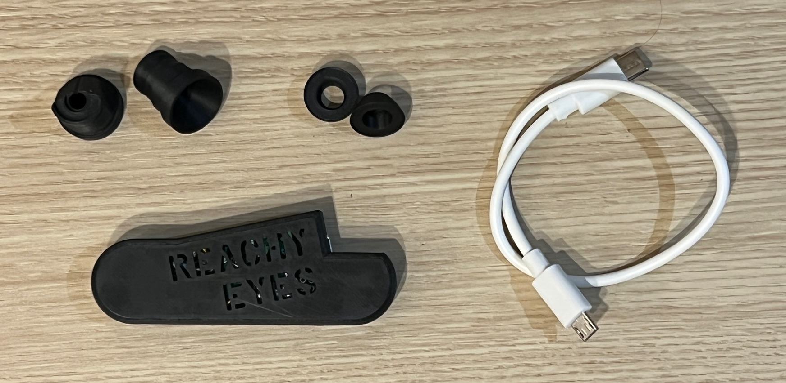

# Reachy Mini Eyes - LITE Hardware Installation Guide

How to install and setup the physical hardware. This guide requires you to partially disassemble your Reachy Mini head. Read this entire guide once before starting.  The entire installation process is expected to take approximately 10-30 minutes.  

**These instructions are specifically for the LITE version and will not work for WIRELESS or BETA versions!**  

> [!WARNING]
> This is an experimental hardware modification. While tested on multiple robots and believed to be a wise upgrade, this is an unofficial modification to your Reachy Mini that is unsupported and has not been approved or endorsed by Pollen. Proceed at your own risk!

## Overview
This covers the installation of the first batch of physical hardware. If you're looking for info about installing software, check the [README](README.md).

## What's Included

While unboxing take care because **the small, doughnut shaped Eye Inserts are loosely stored inside the Eye Towers.** They can be easily removed by turning them upside down and gently tapping on the table.  

**Kit contents:**

  

  
  
 - x1 pre-programmed Reachy Mini Eyes module 
 - x2 Eye Towers
 - x2 Eye Inserts (for alternative eye style) 
 - x1 USB cable 

You will also find a red shipping support. This is not part of the kit and is only used to secure the module in place during shipping.

## Tools Required
 - A soft heavy cloth, like a towel 
 - A small Phillips screwdriver, like the one that came with your Reachy Mini 
 - A small bag for storage of extra parts related to the eye lens
 - Lens cleaner and a lens cleaning cloth is also recommended

## Pre-Installation Testing Recommendation
Testing the eyes is very fast and extremely easy, and for that reason it is **HIGHLY RECOMMENDED** that you bench test the eyes before you perform the installation. Although I'm less concerned about DOA because I personally tested every unit and USB cable before shipping, I did find one robot where the USB port was difficult to plug into fully... this required disassembly of the robot to plug it in firmly.  

My recommendation is that you **test the eyes twice**:  
 1) As soon as the product arrives, plug the USB into your computer and [run any demo](README.md#quick-demo---start-here)
 2) Repeat the test procedure after you've connected the eyes to the robot, but before you put Reachy back together (I will call this out later in the instructions)  

## Decision Point: Choose Your Eye Style

Short version: Go with Option A

Long version: There are multiple eye configurations that are possible, and you might have an opinion as to which one you would want to go with.

You can explore what's involved in the [Option B Installation Guide](INSTALLATION_OptionB.md).

## Installation Instructions
This is the recommended procedure for installing the eyes. Please do not hesitate to contact me for any related support. 

### STEP 1: Prepare the Robot 
 1) Find a nice workspace that is large enough for your robot and tools, and gives you a little extra room to keep everything organized 
 2) Unplug the robot from Power and USB
 3) Lay down the towel in front of you, placing the robot facing you and farther away from you (about arms length away)
 4) Lift Reachy by the head until it fully extends, and lay Reachy face-down with the top of the head towards you.
 5) Remove the 4 screws that hold the head and the face together 
 6) Lift the head out of the way and set it down, being careful to hold the microphone array as you do so (this is why you extended the head in the previous step)
 7) With this, everything can rest here comfortably while you perform the rest of the work. You won't move the face again until it's time for reinstallation

  

  

### STEP 2: Remove the Factory Eye Lenses

Each eye has 3 tabs that hold the eye lens retaining rings in place. These are the same retaining rings you installed during Step 32 of the official Reachy Mini assembly guide. You can release the eyes by gently pulling upward on the eye posts while carefully pressing the tabs to release. These should come out very easily and without much pressure. There is no need to press hard or force anything. Your fingernail is enough but a carefully placed small screwdriver tip or similar makes this easier. 

With the factory eyes removed, you are ready to assemble everything. Store the lenses in case you ever want to return to stock configuration.

### OPTIONAL STEP 3: ONLY for Option B Pinpoint Eyes

**SKIP THIS STEP IF YOU CHOSE OPTION A** 
If you chose Option B, pause here and follow the instructions in [Step 3 of the Option B Installation Guide](INSTALLATION_OptionB.md#alternative-step-3-for-pinpoint-eyes).  

  
### STEP 4: Install Eye Towers 

With the face still sitting on the table, set the two Eye Towers in place. Add the retaining rings that you removed (The ones shown in Step 31 of the official instructions) so that the tabs line up. Once the retaining rings are placed, press down until you hear the satisfying snap, repeating Step 32 of the official installation instructions. This is easier to do if you get your fingers underneath the face and press down with your thumbs.

  

After all 3 tabs click and are secured for both eyes you are ready to move on. The result will be just like the official instructions, but with the Eye Towers from the kit instead of the provided fisheye lenses.  

  

  
  
**IMPORTANT! 🚨 CRITICAL ALIGNMENT STEP — DO NOT SKIP 🚨**
  

  

  
  
The eye towers will need to be rotated before proceeding. Each tower has a sloped face with a line through it.  Make it so these lines are directly aligned towards each other in the center of the towers.  You may feel a little friction when turning them, but they should align relatively easily. If you do not align these towers you may not be able to install the module, or it may not hold securely (alignment does not have to be perfect, just make an effort to be intentional).

### STEP 5: Snap the Eye Module Into Place

> [!INFO]
> The USB bump faces the TOP of the head. The REACHY EYES text will be upside down from your perspective (right side up when the robot is standing).

**You can run the camera ribbon cable in front of or behind the eye module.** The direction doesn't matter, only that bends are curved, not folded. I think it's maybe easier as pictured but I'm unsure if it makes much of a difference. The only thing to watch out for is that you don't pinch or stress the cable. They are flexible and designed for this, but you don't want any sharp creases. There is plenty of extra cable length available to make sure you have a nice easy rounded bend. 

  

    
    
  

The module will easily snap into place. Again, I recommend having your fingers underneath the face and press down with your thumbs. It should not take much effort and will easily go into place on it's own. If you do not have your fingers underneath it is easy to press too hard and pop the eyes out. This can happen but is not a big deal. If a retainer pops out while you are working, simply snap it back into place before proceeding. 

  

### STEP 6: Connect USB & pause to test 

**Plug in the Eyes module side first.** I find that it's easiest to pre-bend the USB cable to make sure that it clears the housing. You don't want to force the USB into place, and you don't want any pressure on it when plugged in. It will slide in to the Eyes Module easily.

For the robot side, hold the microphone array in place with your thumb, and lift the head just enough to get access to the sole available USB port. Once it's plugged in you can set it back down.

  

After the eyes are connected you will want to test connectivity.  
  
**Whether or not you tested out of the box, pause here, reconnect USB for Reachy, and confirm that a demo works...** you don't even need to look under the face to see the eyes functioning, just make sure that your computer recognizes the eyes and the demo plays. It's super easy, just [run any demo](README.md#quick-demo---start-here).  The purpose of this is only to make sure that there is connectivity through the robot to your eyes. If you have that, the rest will work.

If the eyes do not connect, one of these connections is likely not fully seated:
 - Reseat the USB on the eye module, making sure there is not tension on the connection 
 - Reseat the USB inside Reachy

### STEP 7: Reinstall Face

Putting the face of the robot back onto the head is a little tricky, only because it requires managing multiple tasks simultaneously. You'll also need to do a lot of checking as you are doing all of this to make sure you don't tug on the wiring and make sure nothing gets pinched. 

There are two approaches:  
 1) **Solo method:** Hold the face while lifting the robot up to standing, and placing something like a screwdriver through the stewart arms. This will hold the head for you while you reinstall the face.  
 2) **Two-person method:** Ask a friend to hold the head while you managing the face and tuck in wires.

  

Once the face has been returned to the installed position and there is no pressure on any of the wiring inside, go back to the earlier face down position and re-install the 4 screws to reconnect the face. 

  

You're ready to program your eyes to do what you want. It probably took you longer to read the instructions than to do the work! See the [README](README.md) for next steps.

## Troubleshooting
I hope this is all super straightforward and you don't have any problems, but if you do, you know how to reach me. 
