# Reachy Mini Eyes - LITE Hardware Installation Guide

How to install and setup the physical hardware. This guide requires you to partially disassemble your Reachy Mini head. Read this entire guide once before starting.  The entire installation process is expected to take approximately 10-30 minutes.  

**These instructions are specifically for the LITE version and will not work for WIRELESS or BETA versions!**  

> [!WARNING]
> This is an experimental hardware modification. While tested on multiple robots and believed to be a wise upgrade, this is an unofficial modification to your Reachy Mini that is unsupported and has not been approved or endorsed by Pollen. Proceed at your own risk!

## Overview
This covers the installation of the first batch of physical hardware. If you're looking for info about installing software, check the [README](README.md).

## What's Included

While unboxing take care because **the small, doughnut shaped Eye Inserts are loosely stored inside the Eye Towers.** They can be easily removed by turning them upside down and gently tapping on the table.  

**Kit contents:**
 - x1 pre-programmed Reachy Mini Eyes module 
 - x2 Eye Towers
 - x2 Eye Inserts (for alternative eye style) 
 - x1 USB cable 

You will also find a red shipping support. This is not part of the kit and is only used to secure the module in place during shipping.

## Tools Required
 - A soft heavy cloth, like a towel 
 - A small Phillips screwdriver, like the one that came with your Reachy Mini 
 - A small bag for storage of extra parts related to the eye lens
 - Lens cleaner and a lens cleaning cloth is also recommended
 
### Aditional tools ONLY IF choosing Alternative Option B (Pinpoint Eyes):
 - Two strong gripping tools (pliers, vice, etc.)
 - Eye protection
 - Tweezers

## Pre-Installation Testing Recommendation
Testing the eyes is very fast and extremely easy, and for that reason it is **HIGHLY RECOMMENDED** that you bench test the eyes before you perform the installation. Although I'm less concerned about DOA because I personally tested every unit and USB cable before shipping, I did find one robot where the USB port was difficult to plug into fully... this required disassembly of the robot to plug it in firmly.  

My recommendation is that you **test the eyes twice**:  
 1) As soon as the product arrives, plug the USB into your computer and [run any demo](README.md#quick-demo---start-here)
 2) Repeat the test procedure after you've connected the eyes to the robot, but before you put Reachy back together (I will call this out later in the instructions)  

## Decision Point: Choose Your Eye Style

Short version: go with Option A

Long version: there are multiple eye configurations that are possible, and you might have an opinion as to which one you would want to go with.

### Option A: Standard Eyes (Simpler, Recommended)
This is the default, easy way to go, and it works great! It was designed to reduce weight, provide a secure method of mounting, and provide more options for creative installations.

This approach has an added benefit of being able to experiment with diffusion inserts which make the eyes look particularly interesting while lit up... but I skipped shipping these on the first round because it is less than ideal. [Beautiful when on, ghostly white eyes when off](media/EyeOptionA_Diffused.JPG). I will publish more info if I can ever find a material that looks good.

This eye style modifies the look of the eye *slightly.* If you are very particular about the look, or you want the smallest visual source of light, you may consider Option B which has tradeoffs that you can explore. For many reasons, including another small bonus coming, Option A is recommended. Unless you are very comfortable with the tradeoffs, I suggest you start here and revisit later if you'd like to change it. The difference at rest very minor. Here is a direct comparison (A on the left, B on the right): 

  

    <a href="media/EyeOptionA.JPG" target="_blank">
      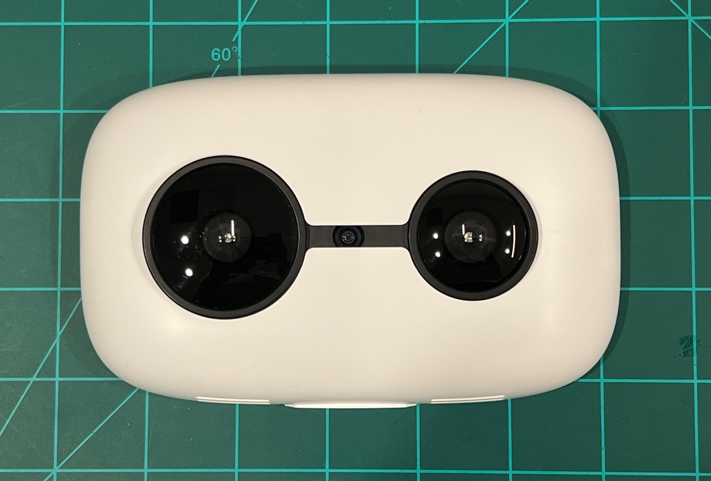
    </a>
    <a href="media/EyeOptionB.JPG" target="_blank">
      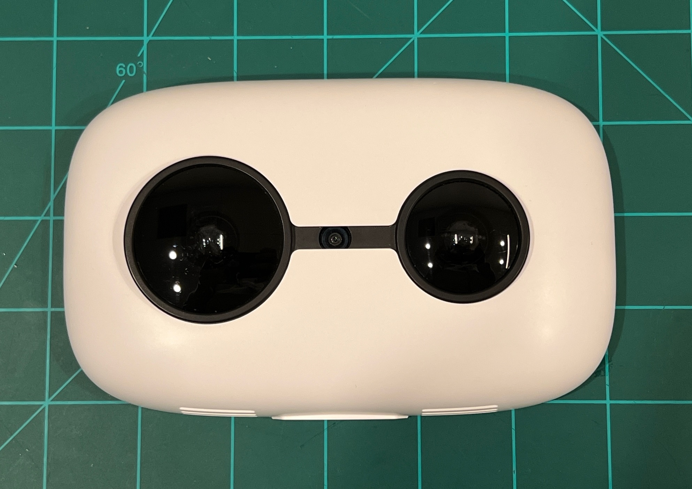
    </a>
  

You can also mix and match styles for the eyes, and explore using different diffusion materials. Pro tip: If you are unsure and want to try different eye types before you commit, you can experiment "on the bench" with the robot eyes out of the head. Simply plug the provided USB directly into your computer; all of the related code will work even without Reachy. You can mix and match eye types, or explore other materials.

### Alternative Option B: Pinpoint Eyes (Destructive, Advanced, Discouraged)

This is a one directional modification. This option also prevents you from returning your robot to factory eye condition.

**REASONS TO NOT CONSIDER THIS:** There are potential risks to this approach. Pollen or someone in the community may come up with a use for the provided lenses. I've also found that lenses differ between robots. All of my lenses worked, but I'm not sure that they will, so you may go through all of this trouble and this modification does not even work for you. If you are very careful it may be possible to re-use the lenses. If you aren't careful, these seem relatively common so it may also be possible to replace the lenses... but always a lot easier to avoid any potential problems and just go with Option A instead. I will also be releasing a future update that allows you to re-use your existing lenses without any modification. It's not exactly the pinpoint eyes, but may be a good middle ground if you prefer the original look.

Everything said, I would not describe this process as terribly difficult if you want to give it a try. This option is primarily offered to preserve the exact look of the factory robot, or in cases where you specifically want the look of the pinpoint eye. I would not necessarily consider this to be an upgrade, but an alternative. Whether or not it is worth the effort is up to you to decide.  It is also possible to change your mind later.  
 
## Installation Instructions
This is the recommended procedure for installing the eyes. Please do not hesitate to contact me for any related support. 

### STEP 1: Prepare the Robot 
 1) Find a nice workspace that is large enough for your robot and tools, and gives you a little extra room to keep everything organized 
 2) Unplug the robot from Power and USB
 3) Lay down the towel in front of you, placing the robot facing you and farther away from you (about arms length away)
 4) Lift Reachy by the head until it fully extends, and lay Reachy face-down with the top of the head towards you.
 5) Remove the 4 screws that hold the head and the face together 
 6) Lift the head out of the way and set it down, being careful to hold the microphone array as you do so (this is why you extended the head in the previous step)
 7) With this, everything can rest here comfortably while you perform the rest of the work. You won't move the face again until it's time for reinstallation

  <a href="media/DissassembleHead_1.JPG" target="_blank">
    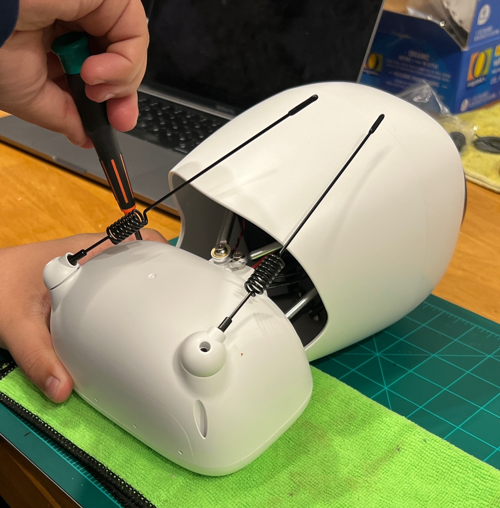
  </a>

  <a href="media/DissassembleHead_2.JPG" target="_blank">
    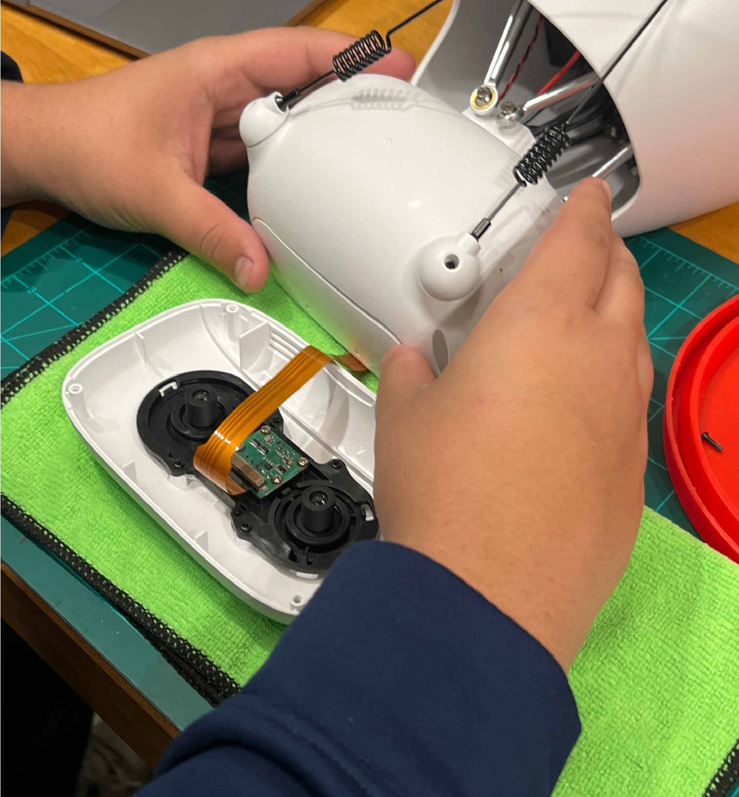
  </a>

### STEP 2: Remove the Factory Eye Lenses

Each eye has 3 tabs that hold the eye lens retaining rings in place. These are the same retaining rings you installed during Step 32 of the official Reachy Mini assembly guide. You can release the eyes by gently pulling upward on the eye posts while carefully pressing the tabs to release. These should come out very easily and without much pressure. There is no need to press hard or force anything. Your fingernail is enough but a carefully placed small screwdriver tip or similar makes this easier. 

With the factory eyes removed, you are ready to assemble everything. Store the lenses in case you ever want to return to stock configuration.

### OPTIONAL STEP 3-A - Only if you chose the alternative for Pinpoint Eyes 

**ALTERNATIVE Option for PinPoint Eyes ONLY: Irreversibly Modify Old Lenses**
**SKIP STEP 3 IF YOU CHOSE OPTION A**
This step permanently modifies your original lenses. There is no reliable way to restore them afterward. Do not proceed unless you are confident in all of these steps and comfortable with the outcome of everything described here.

WEAR EYE PROTECTION. You are likely to damage your old lenses in this process, and these lenses were never intended for disassembly. I think it is plausible (although unlikely) that you could break glass if not careful. I'm told you can get your eyes replaced if you really needed to, but I'm sure it's expensive and annoying. 

The purpose of this step is to use your pliers to break the glue seal between the lens and the housing. Grip the lens threads with one tool, and the retaining ring with another. Apply steady rotational force in the counterclockwise direction until the seal breaks. You'll see the glue come out of the seal and the parts will turn apart. You will need to grasp tightly enough to keep the housing from spinning but not so tight that you mangle the housing.

Once the seal is broken, the parts can be unscrewed by hand. Some of my lenses did not have the seal at all.

We will be re-using a few of the parts. Yours may be slightly different than the ones I show but that is OK (Coming soon, highlighting of the specific parts you will re-use... they are the only ones that fit).

  <a href="media/LensComponents.JPG" target="_blank">
    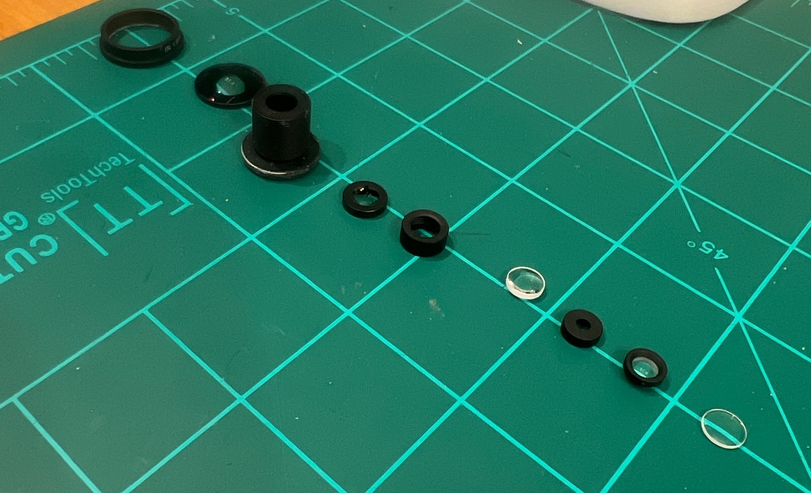
  </a>

### OPTIONAL STEP 3-B - Only if you chose the alternative for Pinpoint Eyes 

**ALTERNATIVE Option for PinPoint Eyes ONLY: Install Lens Parts**
**SKIP STEP 3 IF YOU CHOSE OPTION A**

  <a href="media/AssembleOptionB.JPG" target="_blank">
    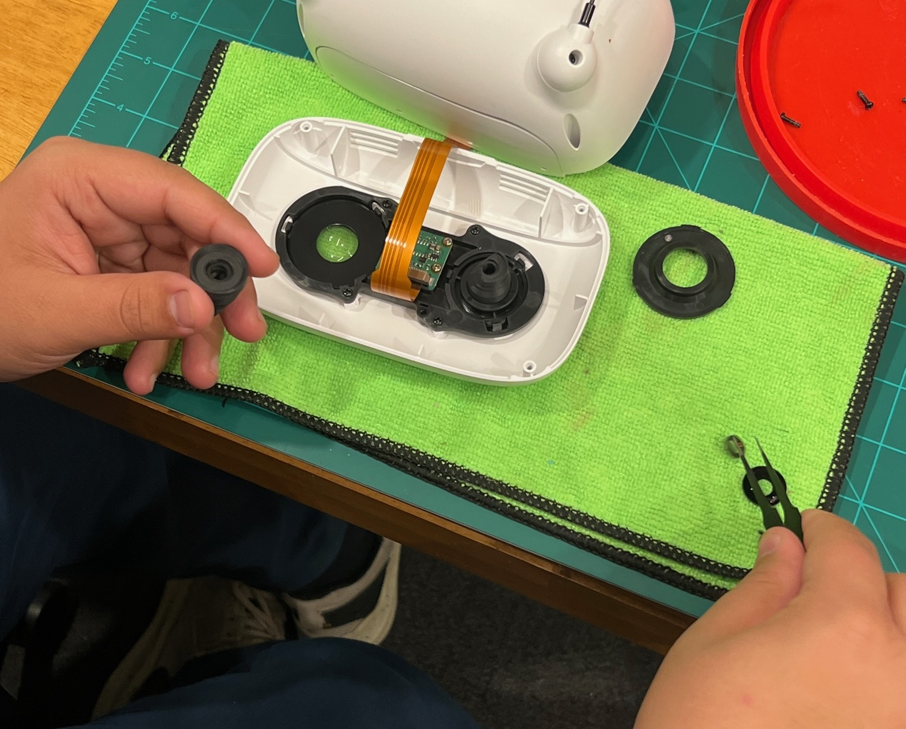
  </a>

 1) Set the Eye Inserts into the Eye Towers (how they arrived when shipped) 
 2) Place parts labeled 1 and 2 into the center of the Eye Inserts. The first once be installed facing either direction. I slightly prefere the second part to have the flat face outward.
 3) Place part 3 (the large lens) on top of the stack. Note that there is nothing to hold it in place. 
 
You'll need to get the lenses underneath the towers, but they are not held in place. I recommend either:
 - Gloves method: Wear clean latex gloves to flip and handle without fingerprints  
 - Lens cloth method: Place cloth over lens, flip tower, gently slide cloth out (added bonus of an extra cleaning swipe when it matters most)  
  
### STEP 4: Install Eye Towers 

With the face still sitting on the table, set the two Eye Towers in place. Add the retaining rings that you removed (The ones shown in Step 31 of the official instructions). Once the retaining rings are in place, press down to snap them in place, repeating Step 32 of the official installation instructions. This is easier to do if you get your fingers underneath the face and press down with your thumbs. 

  <a href="media/Assemble_InstallEyeTowers.JPG" target="_blank">
    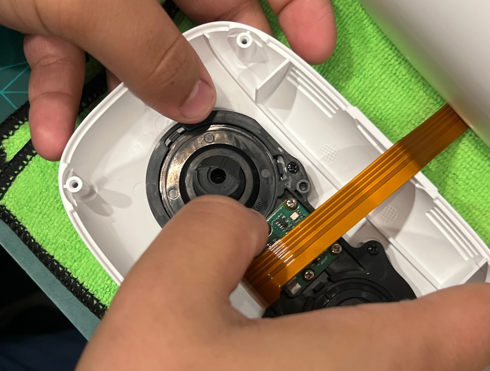
  </a>

When all 3 tabs click and are secure for both eyes you are ready to move on. The result will be just like the official instructions, but with the Eye Towers from the kit instead of the provided lenses.  

  <a href="media/Assemble_AlignEyeTowers.JPG" target="_blank">
    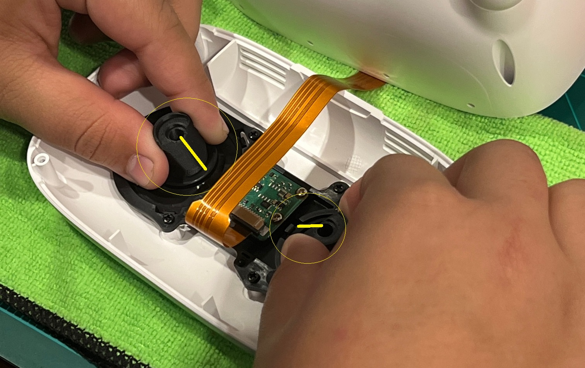
  </a>

  
  
**IMPORTANT! 🚨 CRITICAL ALIGNMENT STEP — DO NOT SKIP 🚨**
  

  <a href="media/Assemble_AlignEyeTowersCloseUp.JPG" target="_blank">
    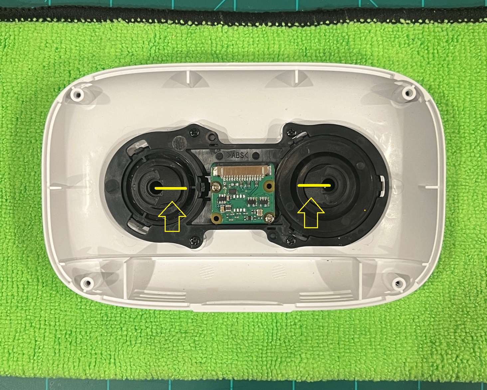
  </a>

  
  
The eye towers will need to be rotated before proceeding. Each tower has a sloped face with a line through it.  Make it so these lines are directly aligned towards each other in the center of the towers.  You may feel a little friction when turning them, but they should align relatively easily. You will not be able to install the module unless these are aligned (it doesn't have to be perfect, just be intentional).

### STEP 5: Snap the Eye Module Into Place

> [!INFO]
> The USB bump faces the TOP of the head. The REACHY EYES text will be upside down from your perspective (right side up when the robot is standing).

**You can run the camera ribbon cable in front of or behind the eye module.** The direction doesn't matter, only that bends are curved, not folded. I think it's maybe easier as pictured but I'm unsure if it makes much of a difference. The only thing to watch out for is that you don't pinch or stress the cable. They are flexible and designed for this, but you don't want any sharp creases. There is plenty of extra cable available so it should be easy to make sure you have a nice rounded bend. 

  

    <a href="media/Assemble_ModuleInstalled.JPG" target="_blank">
      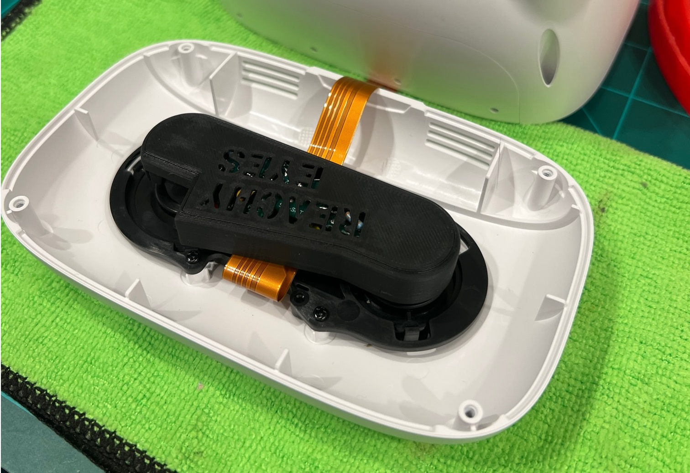
    </a>
    <a href="media/Assemble_InstallModuleRibbonCableZOOM.jpg" target="_blank">
      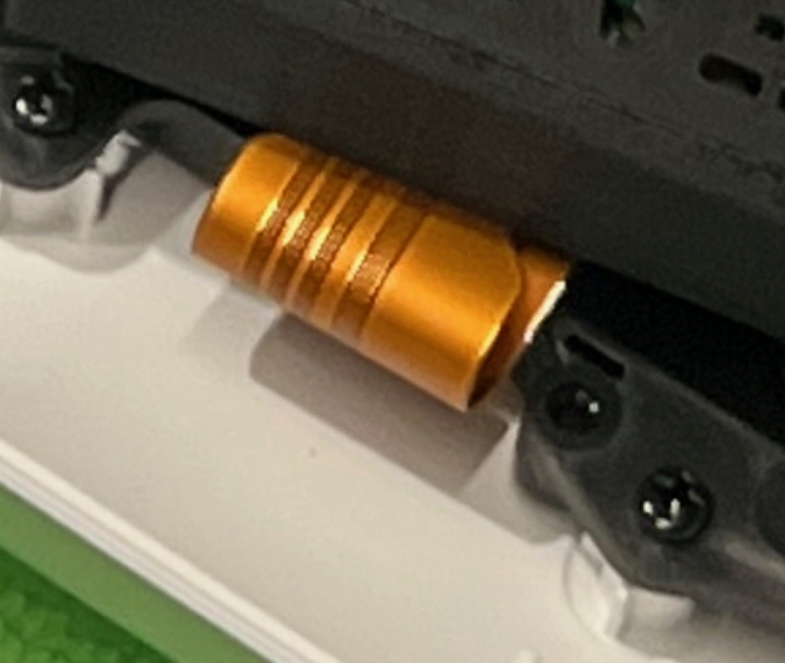
    </a>
  

The module will easily snap into place. Again, I recommend having your fingers underneath the face and press down with your thumbs. It should not take much effort and will mostly go into place on it's own. If you do not have your fingers underneath it is easy to press too hard and pop the eyes out. If a retainer pops out while you are working, simply snap it back into place before proceeding. It can happen but is not a big deal. 

  <a href="media/Assemble_InstallModule.JPG" target="_blank">
    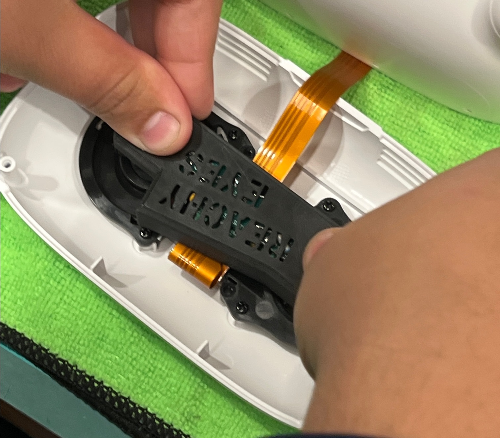
  </a>

### STEP 6: Connect USB & pause to test 

**Start with the Eyes module side.** I find that it's easiest to pre-bend the USB cable to make sure that it clears the housing. You don't want to force the USB into place, and you don't want any pressure on it when plugged in. It will slide in easily.

For the robot side, hold the microphone array in place with your thumb, and lift the head just enough to get access to the sole available USB port. Once it's plugged in you can set it back down.

  <a href="media/Assemble_ReInstallFace-3.JPG" target="_blank">
    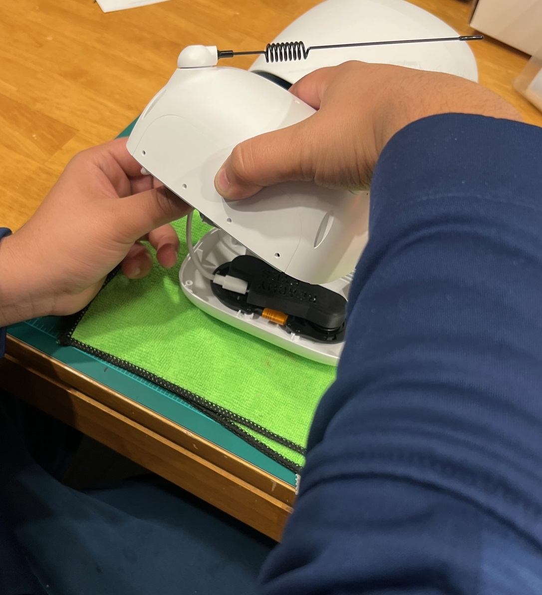
  </a>

After the eyes are connected you will want to test connectivity.  
  
**Whether or not you tested out of the box, pause here, reconnect USB for Reachy, and confirm that a demo works...** you don't even need to look under the face to see the eyes functioning, just make sure that your computer recognizes the eyes and the demo plays. It's super easy, just [run any demo](README.md#quick-demo---start-here).

If the eyes do not power on:
 - Reseat the USB on the eye module, making sure there is not tension on the connection 
 - Reseat the USB inside Reachy
 - 90% of issues are one of these two connections not fully inserted

### STEP 7: Reinstall Face

Putting the face of the robot back onto the head is a little tricky because it requires managing multiple tasks simultaneously. You'll also need to do a lot of checking as you are doing all of this to make sure you don't tug on the wiring and make sure nothing gets pinched. 

There are two approaches:  
**Solo method:** Hold the face while lifting the robot up to standing, and placing something like a screwdriver through the stewart arms. This will hold the head for you while you reinstall the face.  
**Two-person method:** Work together to hold the head while managing the face and tucking in wires.  

  <a href="media/Assemble_ReInstallFace-2.JPG" target="_blank">
    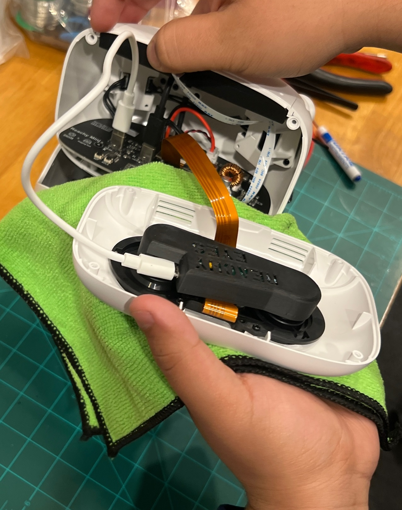
  </a>

Once the face has been returned to the installed position and there is no pressure on any of the wiring inside, go back to your face down position and re-install the 4 screws to reconnect the face. 

  

You're ready to program your eyes to do what you want. It probably took you longer to read the instructions than to do the work! See the [README](README.md) for next steps.

## Troubleshooting
I hope this is all super straightforward and you don't have any problems, but if you do, you know how to reach me. 

