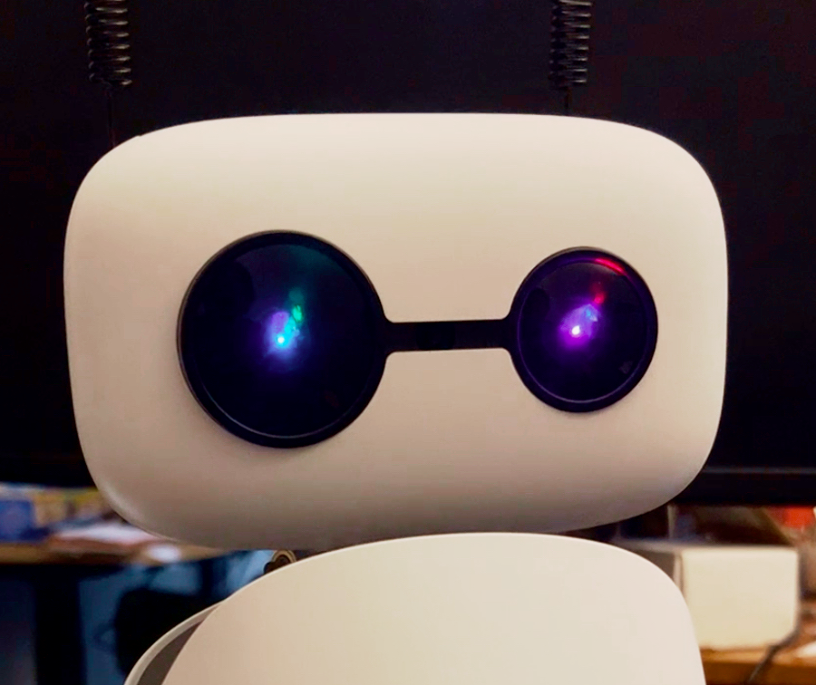
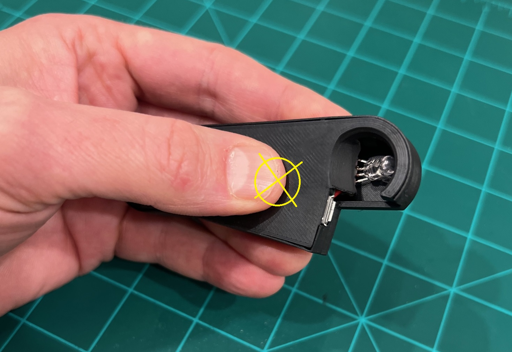

# Reachy Mini Eyes

Control interface for Reachy Mini Eyes. Automatically discovered hardware that gives your Reachy Mini robot fully controllable LED eyes.  



> [!NOTE]
> This is an experimental community project that is not affiliated with or endorsed by Pollen Robotics.

## Quick Demo - START HERE

You can run these straight out of the box, even before installing into the robot. Just plug in the USB and go.

**Get the code:**
```bash
git clone https://github.com/brainwavecollective/reachy-eyes.git
cd reachy-eyes
```

**Run the demos:**  
```bash
# Option 1: Manual installation
pip install pyserial
python demos/demo_all_the_things.py

# Option 2: Automatically pull dependencies with your favorite environment manager
uv run demos/demo_all_the_things.py
```

Any of the example files in `demos/` can be run individually. `demo_all_the_things.py` simply cycles through everything available.  

NOTE: For Linux depending on your permissions you might need to enable udev rules: 
`echo 'SUBSYSTEM=="tty", ATTRS{idVendor}=="2e8a", ATTRS{idProduct}=="10fc", MODE="0666"' | sudo tee /etc/udev/rules.d/99-reachy-eyes.rules && sudo udevadm control --reload-rules && sudo udevadm trigger`


## Repository Structure
```
reachy-eyes/
├── demos/              # Standalone demo scripts
│   ├── _runner.py      # Demo framework (handles imports & cleanup)
│   ├── *.py            # Various demonstrations 
│
├── media/              # Misc. assets 
│
├── reachy_eyes/        # Main component package
│   ├── __init__.py     # Component factory & exports
│   ├── defaults.py     # Default configuration values, set elsewhere
│   ├── device.py       # Low-level serial communication
│   ├── eyes.py         # High-level API (ReachyEyes class) and creative implementations
│   └── protocol.py     # Protocol constants (Color, Effect, Eye, Config)
│
├── pyproject.toml      # Package metadata & dependencies
├── INSTALLATION.md     # Instructions for installing the physical eye module
└── README.md           # This file
```

## Installation

This section covers software. The first step is to [Install the Hardware into your Reachy](INSTALLATION.md)

All of the standard approaches will work, you just need to point to this repo (PyPi coming soon!).

```bash
# HTTPS pip
pip install git+https://github.com/brainwavecollective/reachy-eyes.git

# SSH pip
pip install git+git@github.com:brainwavecollective/reachy-eyes.git

# HTTPS uv
uv run pip install git+https://github.com/brainwavecollective/reachy-eyes.git

# SSH uv
uv run pip install git+git@github.com:brainwavecollective/reachy-eyes.git
```

## Updating Firmware 
Updating firmware is fast and easy. You'll need to do this with the eyes out of the robot.

#### Short version:
1) Download the latest [eyes.uf2 firmware](https://raw.githubusercontent.com/brainwavecollective/reachy-eyes/main/firmware/eyes.uf2)
2) Unplug the eyes device
3) Press on back of case
4) Plug in device & stop pressing on the case
6) A new USB drive will appear with label "RP2350"
7) Copy the `eyes.uf2` file into the RP2350 drive

#### Detailed version:
This will not work if the eyes are plugged in. **With the eyes unplugged**, you'll press on the back of the case and **then plug in the eyes** to put the device into firmware mode. As soon as the eyes are plugged in you won't have to keep pressing. 

Your goal is to depress a small, silent, hidden button. The amount of force that you use is somewhere between "light" and "firm" - think, hard enough to deform the shape of the case, but not so hard that you crush the module. If you are unsure, start light, and repeat with increasing firmness. I hold the device in one hand, and plug in the USB with the other. You will need to press firmly and you do not need a lot of force, but the button is very subtle and **you will may feel a click or anything to tell you whether or not you have pressed hard enough.** My recommendation: start lighter, and repeat with a heavier press if you need to. You're just plugging-in / unplugging so if you need to try a few times it will go fast. 

You will know when the device is in firmware mode because a new USB drive will show up on your computer with the label "RP2350."  Once the drive shows up, simply copy the `eyes.uf2` file into the drive. The drive will automatically disconnect and dissappear. **This is normal** and when this happens the update is complete. It happens fast and the device will automatically reconnect. You can confirm everything works by running a demo. 

The place you are pressing is in the middle, about 1-2cm from the usb port, but if you are in the approximate area it will work. Here's a picture that shows exactly where to press:
<div style="text-align: center;">
  <a href="media/FirmwarePress.JPG" target="_blank">
    
  </a>
</div>

## Programmatic Access 

Use the API for app integration. pip install coming soon (For now it is recommended to use the git dependency format)

```python
import reachy_eyes
eyes = reachy_eyes.create()
```

### Color Controls
```python
eyes.set_color(Color.RED)
eyes.set_color(Color.BLUE, duration=1.5)
eyes.set_color("GREEN", eye="LEFT")
eyes.set_color(Color.GREEN, eye=Eye.LEFT)
eyes.off()
```

Available: `WHITE`, `RED`, `GREEN`, `BLUE`, `AMBER`, `CYAN`, `MAGENTA`  

### Built-In Effects
```python
eyes.blink()
eyes.ack()
eyes.startle()
```

### State Modification
```python
eyes.set_intensity(0.4)
eyes.set_energy(0.6)
```

### Autonomous Background Behavior
```python
eyes.enable_blinking()
eyes.disable_blinking()
```

---

## Contributing
This project is in active development. Feel free to open issues for bugs, feature requests, or to propose changes.

---

## Robot Component Integration

It is not difficult to interact with the eyes directly, but I'm optimistic that these eyes can be driven as part of a first-class component runtime for Reachy Mini robots. I've proposed an approach that will take some time to work through with the Pollen team. You can check [PR #755](https://github.com/pollen-robotics/reachy_mini/pull/755) for current status and join the conversation. If you have thoughts related to the solution, please comment!

--- 

## Status
This project is in early development and actively maintained (Q1 2026).

**Licensing:** Decisions will be made as the project matures.  
**Usage:** Feel free to view and reference this code for personal learning.  
**Commercial/Partnership/Distribution:** Please [email Daniel](mailto:daniel@brainwavecollective.ai)
